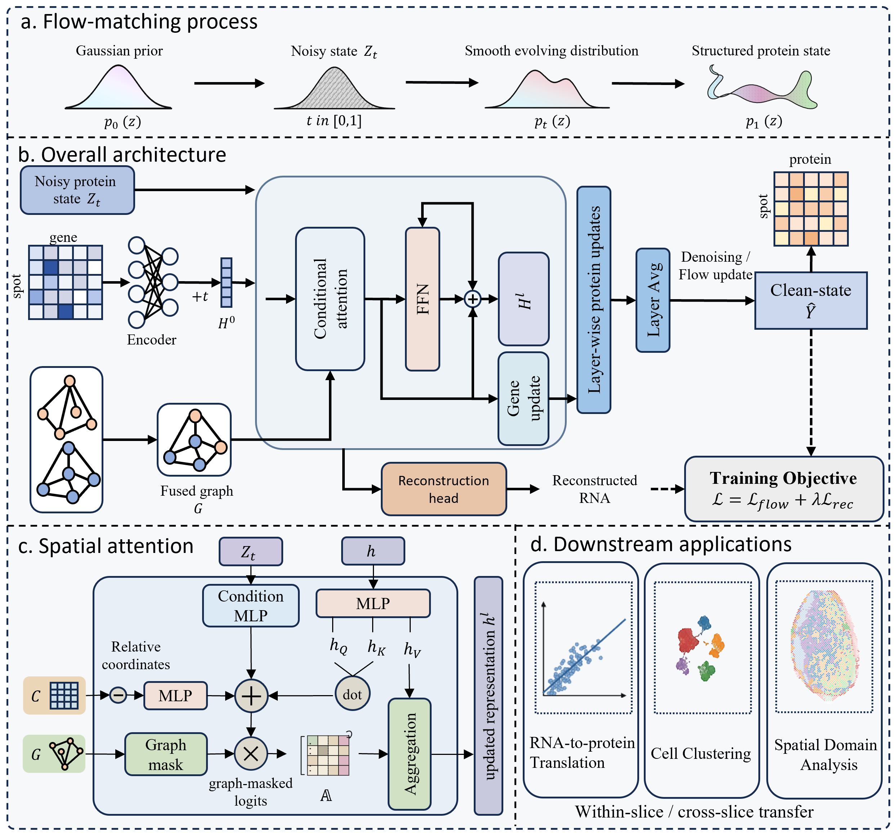

# SPINE

SPINE is a PyTorch package for RNA-to-protein prediction on spatial omics data.



## Environment

Recommended environment for this repository:
- Python `3.12.9`
- PyTorch `2.7.0+cu118`

## Organization

The organization of this repository is as follows:
- `app/`: contains the SPINE application entry points
    - `flow/`: training pipeline for SPINE
- `data/`: contains the dataloader for the SPINE model
- `model/`: contains the implementation of denoiser
- `app/preprocessing/`: contains preprocessing scripts and notes
- `io_utils/`: contains lightweight h5/h5ad loading helpers used by the RNA-to-protein data pipeline


## Usage

Install dependencies and the package with:

```bash
pip install -r requirements.txt
pip install -e .
```

Preprocessing notes and scripts are in `spine/app/preprocessing/`.
For the release demo, the raw Human Lymph Node A1 files are bundled at:
`demo_data/raw/Dataset1_Human_Lymph_Node_A1/adata_RNA.h5ad` and `adata_ADT.h5ad`.

Training SPINE (release demo on Human Lymph Node A1) with the following script:
```bash
python spine/app/flow/train_rna_to_protein.py \
    --dataset DATASET1_RNA_TO_PROTEIN \
    --source_dataroot /path/to/source_dataroot \
    --embed_dataroot /path/to/embed_dataroot \
    --exp_code spine_release_demo_lymph_a1 \
    --batch_size 1 \
    --epochs 500
```

## Citation

If you find SPINE or this repository useful in your research, please cite our paper:

```bibtex
@article{lu2027spine,
  title   = {{SPINE}: Context-guided iterative protein inference from spatial transcriptomes},
  author  = {Lu, Xingming and Xu, Jiangshan and Wang, Jiajin and Fan, Nuodi
             and Wan, Sijie and Mao, Jin and Fu, Yunqing and Zeng, Yuansong},
  journal = {Expert Systems with Applications},
  volume  = {332},
  pages   = {133652},
  year    = {2027},
  issn    = {0957-4174},
  doi     = {10.1016/j.eswa.2026.133652},
  url     = {https://www.sciencedirect.com/science/article/pii/S0957417426025601}
}
```

